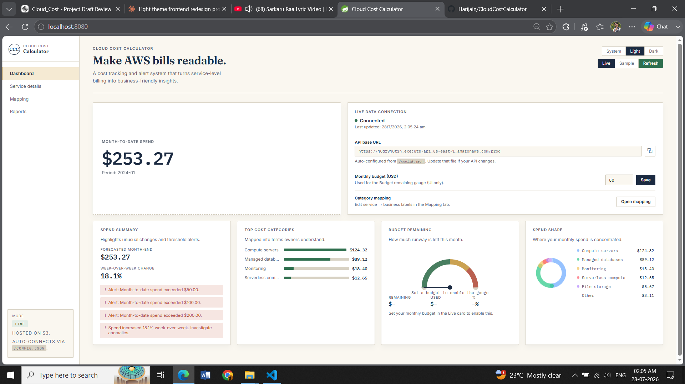
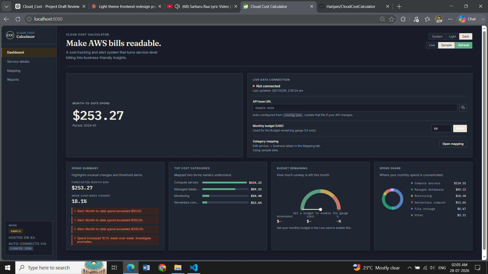
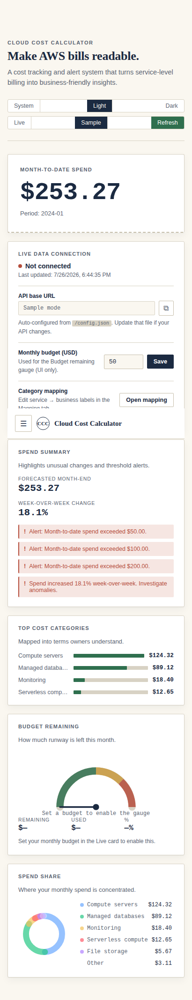
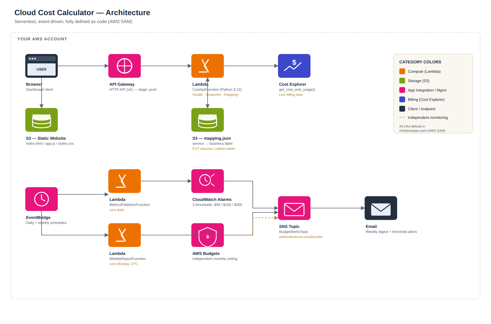

# Cloud Cost Calculator

**A serverless AWS billing dashboard that turns raw AWS service names into numbers a human can actually act on.**

AWS Cost Explorer tells you `EC2 - Other` cost `$124.32` this month. It doesn't tell your founder, your PM, or your finance lead what that means — and it doesn't email anyone when it starts climbing. This project sits on top of Cost Explorer, translates the noise into plain business categories, and pushes a weekly digest to your inbox automatically, no AWS console login required.

Everything here — the API, the alerting, the infrastructure, the dashboard — is built and deployed as a real, working AWS stack, not a mockup.

---

## What it actually does

- Pulls **live** month-to-date spend from AWS Cost Explorer on every request — no caching, no stale numbers
- Maps raw AWS service names (`Amazon Simple Storage Service`) into business-readable categories (`File storage`) — fully user-editable, no redeploy needed to add new mappings
- Tracks a monthly budget and visualizes runway with an instrument-style gauge
- Fires multi-threshold **CloudWatch Alarms** and an **AWS Budget** when spend crosses configurable limits
- Sends an automated **weekly spend-comparison email** via SNS, comparing this week's spend to last week's
- Ships as a static site — no server to run, no framework, opens instantly from S3

---

## Screenshots

**Light theme**


**Dark theme** 


**Mobile**



---

## Architecture

Everything AWS-side is defined as code in `infra/template.yaml` (AWS SAM) and deploys with one command — no resource was ever clicked into existence by hand.



The request path (top row) is what runs on every dashboard load — browser → API Gateway → Lambda → live Cost Explorer call. The background path (bottom row) runs independently of any user traffic — EventBridge schedules trigger the metrics publisher and weekly report Lambdas, which feed CloudWatch Alarms and AWS Budgets into a shared SNS topic that emails alerts and the weekly digest.

### Stack

| Layer | Technology | Why |
|---|---|---|
| Compute | AWS Lambda (Python 3.12) | Usage is bursty and infrequent — a handful of requests a day plus two scheduled jobs. Paying per-invocation beats an always-on server for this shape of traffic. |
| API | API Gateway — HTTP API (v2) | Cheaper and lower-latency than REST API (v1) for simple proxy-style routing; this project doesn't need REST API's heavier request-validation features. |
| Infra as Code | AWS SAM | Native AWS tooling, no extra state backend to manage, shorthand syntax for Lambda + API wiring. |
| Frontend hosting | S3 static website | The dashboard is static HTML/CSS/vanilla JS — no server-side rendering need, so S3 serves it directly for cents a month. |
| Alerting | SNS + CloudWatch Alarms + AWS Budgets | Three composable, AWS-native layers instead of a third-party alerting service. |
| Frontend | Vanilla HTML/CSS/JS, no framework | Four views, no complex state — a build step and bundle size would add cost with no real benefit here. |

---

## API

| Method | Route | Description |
|---|---|---|
| `GET` | `/health` | Liveness check |
| `GET` | `/snapshot` | Live month-to-date spend, grouped and mapped to business labels |
| `GET` | `/mapping` | Current service → business-label mapping |
| `PUT` | `/mapping` | Update the mapping. Requires `x-admin-token` header |

---

## How the numbers are calculated

```
month_to_date_spend  = Σ cost of every AWS service this month  (from Cost Explorer)
forecast_month_end   = (month_to_date_spend / days_elapsed) × 30
week_over_week_pct   = ((this_week − last_week) / last_week) × 100
budget_used_pct      = (month_to_date_spend / budget_limit) × 100
```

The forecast is an intentionally simple linear projection, not a trend-fitted model — kept transparent rather than opaque. The on-screen budget gauge is a UI convenience backed by browser storage; the *enforced* budget threshold is the separate AWS Budgets resource defined in the SAM template.

---

## Deploying your own copy

**Prerequisites:** AWS CLI, AWS SAM CLI, an AWS account with Cost Explorer enabled (can take up to 24h to activate on a new account).

```bash
# 1. Build
sam build --template infra/template.yaml

# 2. Deploy — prompts for AlertEmail, MonthlyBudgetAmountUsd, and AdminToken
sam deploy --guided
```

This provisions three Lambda functions, an HTTP API, an S3 bucket, an SNS topic, three CloudWatch alarms, and an AWS Budget. On completion it prints `ApiBaseUrl` and `DashboardWebsiteUrl`.

Point the frontend at your API by editing `docs/config.json`:

```json
{
  "apiBaseUrl": "<your ApiBaseUrl from the deploy output>",
  "defaultBudgetLimitUsd": 200
}
```

Then confirm the SNS email subscription — check your inbox and confirm via the AWS CLI rather than clicking the email link directly (see note below).

### Running locally

```bash
cd docs
python -m http.server 8080
```

Open `http://localhost:8080`. Use the **Sample** mode toggle to explore the UI without touching real AWS data or incurring Cost Explorer API charges (~$0.01/call in Live mode).

---

## Real issues hit while building this

Left in deliberately — these were genuine bugs found while deploying to a real AWS account, not hypotheticals.

- **API Gateway HTTP API stage-prefix routing.** With a named stage (`prod`, not the default `$default`), API Gateway includes the stage as part of `rawPath` — so a Lambda checking for exactly `/health` will 404 on `/prod/health`. Fixed by stripping the stage prefix before route matching.
- **SNS topic policy rejects wildcard actions.** `"Action": "sns:*"` looks like standard IAM shorthand but SNS topic policies reject it outright with `Policy statement action out of service scope`. Fixed by enumerating the actual SNS actions explicitly.
- **Email security scanners silently triggering SNS unsubscribe.** Some mail clients pre-visit every link in an incoming email, including the one-click unsubscribe link in SNS notification footers — which counts as a real unsubscribe. Fixed by confirming subscriptions via the AWS CLI (so no browser ever visits the link) and enabling `authenticate-on-unsubscribe`, which requires signed AWS auth to unsubscribe.
- **CloudFormation drift after a manual console deletion.** Deleting a resource by hand in the console while CloudFormation still tracks it as owned breaks the next `sam deploy` with a "does not exist" error, since CloudFormation only reconciles template diffs, not real-world state. Resolved by a clean stack delete + redeploy.

---

## Project structure

```
CloudCostCalculator/
├── backend/            # Lambda source (API handler, metrics publisher, weekly report)
├── infra/              # AWS SAM / CloudFormation template
├── docs/                # Static frontend (index.html, styles.css, app.js) — S3-hosted
│   └── data/            # Sample data for offline/demo mode
└── lambda/              # Supporting Lambda assets
```

---

## License

MIT